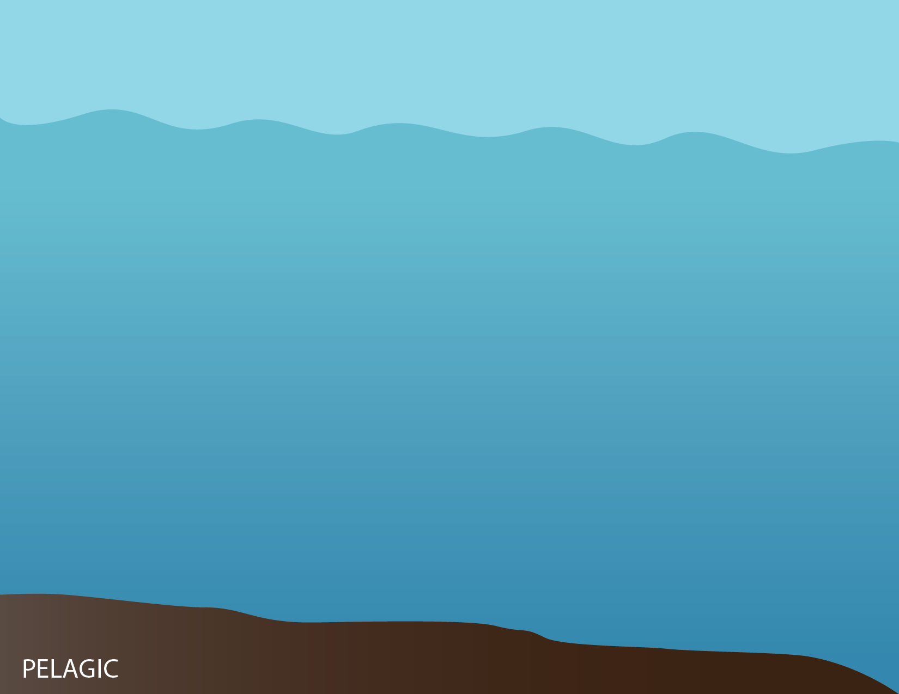

```{r svgs, echo=FALSE}
svg_pinniped = readLines('svg/pinniped.svg')
```

<div class="container"><a href='pelagic_ts/pinnipeds.html' data-title="Pinnipeds" data-remote="false" data-toggle="modal" data-target="#myModal"><span>`r svg_pinniped`</span></a></div>

<!-- Modal -->
<div class="modal fade" id="myModal" tabindex="-1" role="dialog" aria-labelledby="myModalLabel">
  <div class="modal-dialog" role="document">
  <div class="modal-content">
  <div class="modal-header">
  <button type="button" class="close" data-dismiss="modal" aria-label="Close"><span aria-hidden="true">&times;</span></button>
  <h4 class="modal-title" id="myModalLabel">Modal title</h4>
  </div>
  <div class="modal-body">
  ...modal body...
  </div>
  </div>
  </div>
</div>

<script>
$('#myModal').on('show.bs.modal', function (e) {
  var link = $(e.relatedTarget);
  $(this).find(".modal-title").text(link.data("title"));
  $(this).find(".modal-body").html('<iframe frameborder="0" width="100%" height="850" src="URL">'.replace('URL',link.attr("href")))
})
</script>